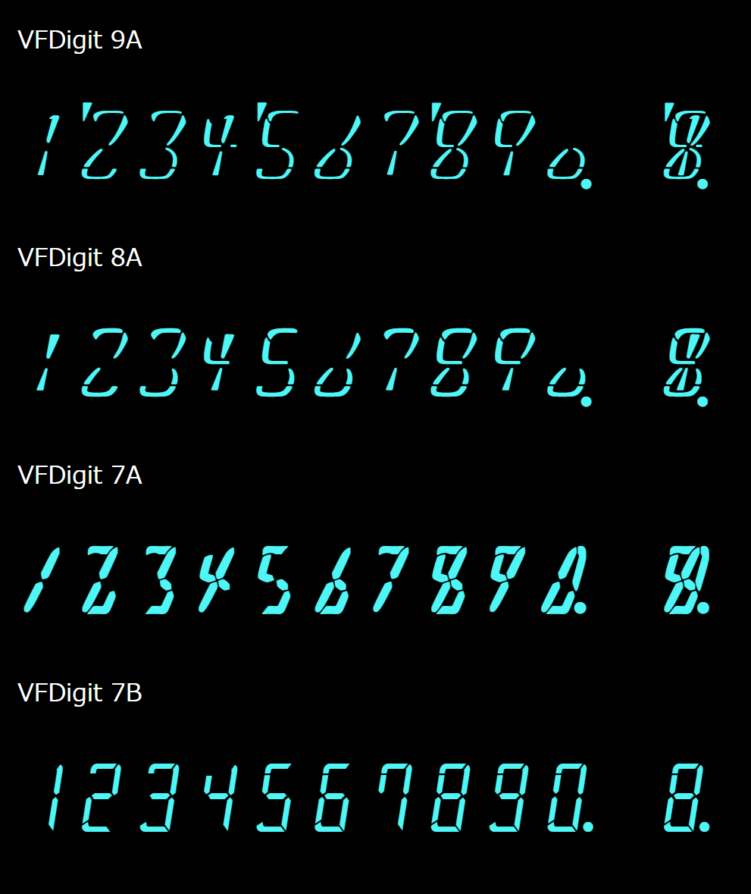

# VFDigit

Fonts that imitates the vacuum fluorescent display (VFD) around 1970.

## Download

https://github.com/jz5/fonts-vfdigit/tree/main/release

## Description and samples

See https://pronama.jp/vfdigit/

## License

[SIL Open Font License](https://scripts.sil.org/cms/scripts/page.php?site_id=nrsi&id=ofl)

## Contribution

Please post an issue first.
